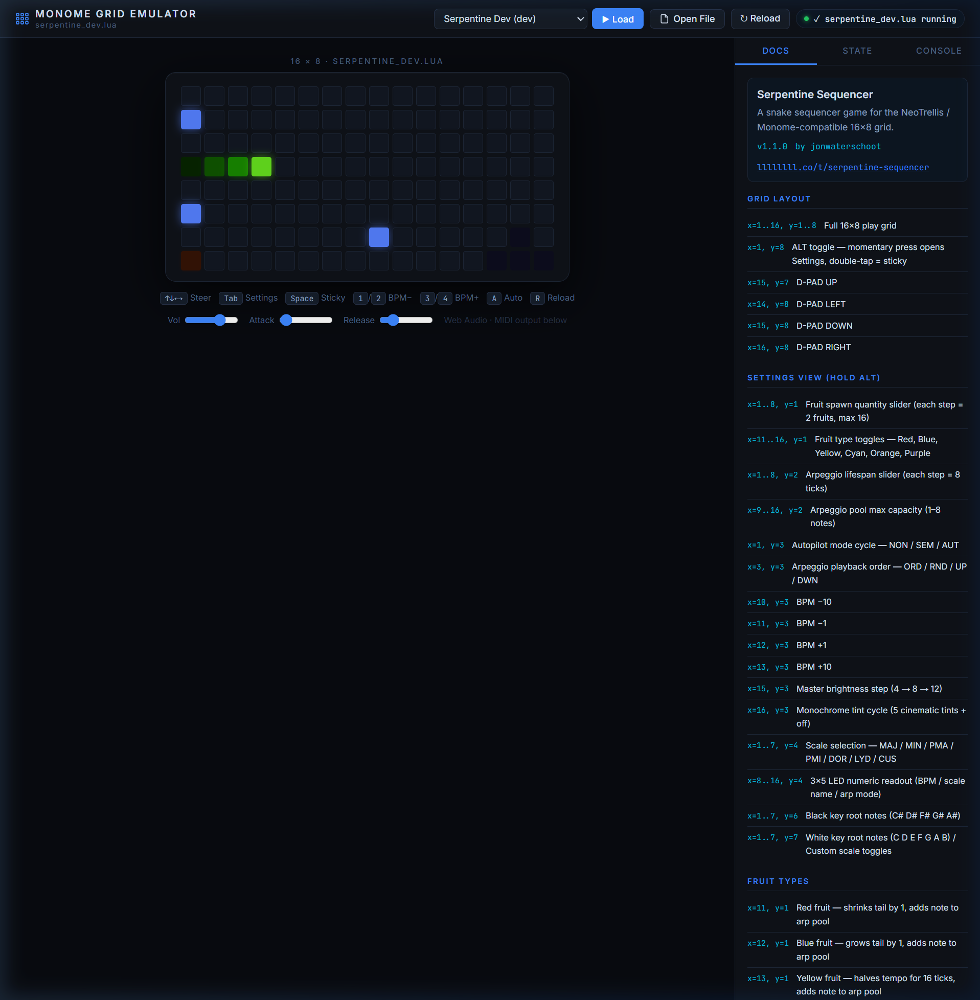

# Universal Monome Grid Lua Emulator — Walkthrough

A browser-based emulator that runs **real `.lua` scripts natively** using the
[Fengari](https://fengari.io) Lua 5.3 runtime, with a Node.js hot-reload dev
server. Designed as a universal development tool for any Monome-compatible grid
script.

---

## Screenshot



*The emulator running `serpentine_dev.lua` — snake in motion, docs panel populated
from LDoc comments, hot-reload active.*

---

## Project Structure

```
emulator/
├── emulator.html           ← Main UI (grid, script browser, docs/state/console panel)
├── serve.js                ← Node.js dev server + WebSocket hot-reload broadcaster
├── package.json            ← Single dependency: ws
├── docs/
│   └── walkthrough.md      ← This file
├── scripts/
│   ├── manifest.json       ← Script registry (name, file, version, description)
│   ├── serpentine_dev.lua  ← Live dev copy (synced from parent folder)
│   └── serpentine.lua      ← Stable reference copy
└── engine/
    ├── monome-api.js       ← Hardware shim layer
    ├── lua-loader.js       ← Fengari execution bridge + hot-reload WS client
    └── doc-extractor.js    ← LDoc-style comment parser
```

---

## Quick Start

```powershell
# From inside the emulator/ directory:
node serve.js
```

Open **http://localhost:3141/** in any browser.

> The File Picker button works even without the server — you can drag any `.lua`
> file from disk directly.

---

## Architecture

### 1. Script Loading

`emulator.html` fetches `scripts/manifest.json` on startup and populates the
dropdown selector. Clicking **▶ Load** fetches the `.lua` source over HTTP and
passes it to the Lua runtime. The **Open File** button accepts any local `.lua`
without requiring the server.

### 2. Fengari Execution (`engine/lua-loader.js`)

```
Source (.lua)
     │
     ▼
luaL_newstate()         ← fresh Lua VM per script load
luaL_openlibs()         ← math, string, table, etc.
     │
     ├─ Inject globals  ← grid_led, midi_note_on, metro.init, wrap, get_time…
     │
luaL_loadbuffer()       ← compile Lua source
lua_pcall()             ← execute
     │
     └─ Capture event_grid global → wired to pad clicks
```

All MonomeAPI functions are injected as C-closures that delegate to the JS
`MonomeAPI` class.

> **Fengari API note:** In `fengari-web@0.1.4`, `to_luastring` is a **top-level
> export** on `window.fengari`, not nested inside `fengari.lua`. Always
> destructure it as:
> ```js
> const { lua, lualib, lauxlib, to_luastring } = window.fengari;
> ```

### 3. Grid Rendering (`engine/monome-api.js`)

| Lua call | JS result |
|---|---|
| `grid_led(x, y, lum)` | writes mono `{r,g,b}` to frame buffer |
| `grid_led_rgb(x, y, r, g, b)` | writes RGB to frame buffer |
| `grid_led_all(lum)` | fills entire frame buffer |
| `grid_refresh()` | flushes buffer → updates `.pad` DOM elements |
| `grid_color_intensity(val)` | sets master brightness multiplier |

Every `grid_refresh()` call applies the master brightness and sets
`background` + `box-shadow` CSS on each pad for the glow effect.

### 4. Hot-Reload (`serve.js` + `lua-loader.js`)

```
Edit .lua file on disk
        │
    fs.watch()                 ← serve.js watches scripts/
        │
    WebSocket broadcast        ← { type: "file_changed", name: "..." }
        │
    browser receives message   ← lua-loader.js
        │
    re-fetch + re-execute      ← ~150ms turnaround
```

The WebSocket reconnects automatically if the server restarts.

### 5. Documentation Extraction (`engine/doc-extractor.js`)

The doc extractor scans Lua source for LDoc-style comments and populates the
**Docs** and **State** sidepanel tabs automatically after each script load.

**Recognised patterns:**

```lua
-- scriptname: My Script      ← populates script meta card
-- v1.2.3
-- @author: yourname
-- llllllll.co/t/thread-link

-- @section Grid Layout        ← creates a named section in the Docs tab

-- x=1..8, y=1: Some control  ← control map entry (location + description)
-- x=1, y=8: ALT toggle

--- Short description.         ← function doc (triple-dash)
-- @tparam number x  Column (1-based)
-- @treturn boolean  Success flag
local function my_fn(x) ... end

local bpm = 120                ← captured in the State tab (simple scalars)
```

---

## Keyboard Shortcuts

| Key | Grid equivalent | Action |
|-----|----------------|--------|
| `↑ ↓ ← →` | D-PAD (x15-16, y7-8) | Steer snake |
| `Tab` | ALT (x1, y8) | Open settings (hold) |
| `Space` | ALT (x1, y8) | Sticky settings toggle |
| `1` / `2` | x10-11, y3 | BPM −10 / −1 |
| `3` / `4` | x12-13, y3 | BPM +1 / +10 |
| `A` | x1, y3 | Cycle autopilot: NON → SEM → AUT |
| `R` | — | Reload current script |

---

## Adding a New Script

1. Copy your `.lua` file into `emulator/scripts/`
2. Add an entry to `emulator/scripts/manifest.json`:

```json
{
  "name": "My Script",
  "file": "my_script.lua",
  "version": "1.0.0",
  "description": "What it does"
}
```

3. The dropdown will include it on next page load (or reload).

---

## LDoc Annotation Cheatsheet

Paste this header at the top of any script to enable full doc extraction:

```lua
-- scriptname: Script Name
-- v1.0.0
-- @author: yourname
-- llllllll.co/t/thread

-- A one-line description shown under the title.

-- @section Controls
-- x=1..8, y=1: Main slider — does X
-- x=1, y=8: ALT toggle — opens settings

-- @section Internal
--- Initialise the game state.
-- @tparam number seed  Random seed
local function init(seed) ... end
```

---

## MIDI Output

Connect a MIDI output via the bottom bar dropdown. The emulator sends:
- `0x90` Note On (from `midi_note_on`)
- `0x80` Note Off (from `midi_note_off`)

Web Audio synthesis runs as a fallback whenever no MIDI output is selected,
using a triangle-wave oscillator with configurable volume, attack, and release
(sliders below the grid).

---

## Extending the Hardware Shim

To add a new API function for a Lua script to call, edit `engine/monome-api.js`
to add the JS-side implementation, then register it in `engine/lua-loader.js`
using `setGlobal`:

```js
// In lua-loader.js _execute(), after other setGlobal calls:
setGlobal('my_new_fn', (L2) => {
  const val = getInt(L2, 1);   // first Lua argument
  api.my_new_fn(val);
  return 0;                    // number of return values pushed
});
```

```js
// In monome-api.js:
my_new_fn(val) {
  // JS implementation
}
```
